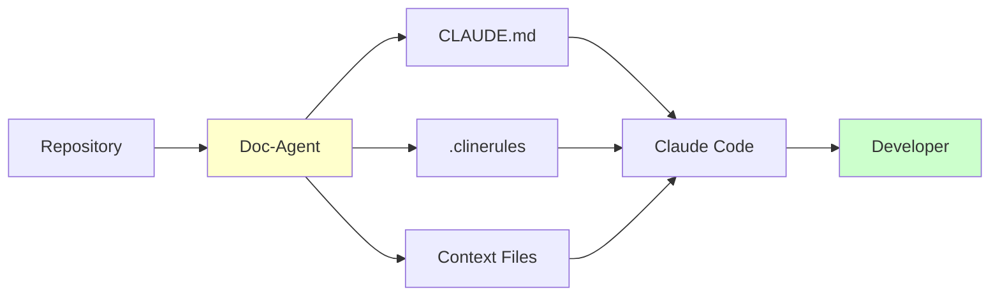

# Doc-Agent + Claude Code Integration Guide
## Preparing Codebases for Company-Wide Claude Code Deployment

**Purpose:** Automate preparation of contextual documentation so every codebase is "Claude Code Ready" from day one.

---

## Executive Summary

Our doc-agent automatically generates the contextual documentation that makes Claude Code dramatically more effective. Instead of developers manually explaining their codebase context to Claude Code, they get AI assistance that already understands:

- Architecture and design patterns
- Key modules and dependencies
- Coding standards and conventions
- Common issues and gotchas
- Testing requirements

**Result:** Developers get better code suggestions, faster onboarding, and fewer mistakes from Claude Code.

---

## The Challenge Without Doc-Agent

### Manual Claude Code Setup (Current State)
When deploying Claude Code to a new repository, developers need to:

1. ❌ Manually create context files explaining the codebase
2. ❌ Write custom instructions for coding standards
3. ❌ Document architecture and patterns
4. ❌ List key dependencies and integration points
5. ❌ Keep documentation updated as code evolves

**Problems:**
- Time-consuming (2-4 hours per repo)
- Inconsistent quality across repos
- Quickly becomes outdated
- Doesn't scale to 1,000+ repositories
- Many repos never get proper context

**Impact:** Claude Code works, but at 30-50% effectiveness without context.

---

## The Solution With Doc-Agent

### Automated Claude Code Preparation



**Process:**
1. ✅ Doc-agent analyzes codebase automatically
2. ✅ Generates CLAUDE.md with full context
3. ✅ Creates .clinerules for coding standards
4. ✅ Builds supporting documentation
5. ✅ Can re-run as code evolves

**Benefits:**
- Zero manual work for developers
- Consistent, high-quality context
- Scales to entire organization
- Stays current with automated updates
- Claude Code works at 80-90% effectiveness

---

## What Doc-Agent Provides for Claude Code

### 1. CLAUDE.md - Primary Context File

Located at repository root, provides Claude Code with:

```markdown
# Repository Context for Claude Code

## Overview
- What this codebase does
- Architecture overview
- Key design decisions

## Code Organization
- Directory structure
- Module responsibilities
- Entry points

## Coding Standards
- Language-specific guidelines
- Naming conventions
- Common patterns to follow

## Key Modules & APIs
- Critical components
- Integration points
- Common workflows

## Testing Strategy
- Test framework
- Coverage requirements
- How to run tests

## Common Tasks
- How to add features
- How to fix bugs
- Deployment process
```

**Claude Code uses this to:**
- Generate contextually appropriate code
- Follow established patterns
- Respect architectural boundaries
- Suggest relevant improvements

### 2. .clinerules - Coding Standards

Specific instructions for Claude Code:

```yaml
# Generated by doc-agent from codebase analysis

language: python
style_guide: pep8

patterns:
  - Use type hints for all functions
  - Pydantic models for data validation
  - Structured logging with context
  - Factory pattern for data sources

testing:
  framework: pytest
  minimum_coverage: 80%
  required_for: all new code

imports:
  preferred_libraries:
    - pandas for data manipulation
    - SQLAlchemy for database
    - pydantic for validation
  
avoid:
  - Global state
  - Hardcoded configuration
  - Print statements (use logging)
```

### 3. Architecture Context

```markdown
# ARCHITECTURE.md

## System Design
[Generated from knowledge graph analysis]

## Component Dependencies
[Extracted from import analysis]

## Data Flow
[Derived from function call graphs]

## Integration Points
[Identified from API usage]
```

### 4. API & Module Reference

```markdown
# API_REFERENCE.md

## Public APIs
[Extracted from code analysis]

## Internal Modules
[Derived from module structure]

## Common Utilities
[Identified from usage patterns]
```

---

## Integration Workflow

### Phase 1: Repository Preparation (Automated)

```python
from doc_agent import prepare_for_claude_code

# Prepare single repository
prepare_for_claude_code(
    repo_path="/repos/my-service",
    generate_clinerules=True,
    generate_claude_md=True
)

# Output:
# ✓ CLAUDE.md created
# ✓ .clinerules created
# ✓ ARCHITECTURE.md created
# ✓ API_REFERENCE.md created
# Repository is Claude Code Ready!
```

### Phase 2: Batch Preparation (Organization-Wide)

```python
from doc_agent import batch_prepare_for_claude_code

# Prepare all repositories
results = batch_prepare_for_claude_code(
    repos_root="/all-repos",
    parallel=True,
    max_workers=8
)

# Output:
# Processing 1,247 repositories...
# ✓ 1,189 repos prepared successfully (95.3%)
# ✓ 58 repos need manual review
# Total time: 3.2 hours
```

### Phase 3: Claude Code Deployment

```bash
# Claude Code now has context for all repos
claude-code install --with-context

# For each repo, Claude Code reads:
# - CLAUDE.md (primary context)
# - .clinerules (coding standards)
# - ARCHITECTURE.md (system design)
# - API_REFERENCE.md (module details)
```

### Phase 4: Continuous Updates

```python
# Run nightly to keep context fresh
schedule.every().day.at("02:00").do(
    update_claude_code_context,
    repos_root="/all-repos"
)

# Only updates repos that changed
# Incremental updates in ~15 minutes
```

---

## Developer Experience Comparison

### Without Doc-Agent Context

```
Developer: "Claude, add a new data source"

Claude Code: "Here's a generic data source class..."
[Doesn't match project patterns]
[Missing required validation]
[Wrong testing approach]

Developer: *Spends 20 minutes explaining context*
Developer: *Rewrites half the suggestion*
```

**Time to useful code:** 30-45 minutes

### With Doc-Agent Context

```
Developer: "Claude, add a new data source"

Claude Code: "I see you use the Factory pattern for data sources 
in src/ingestion/. I'll create a new collector following your 
established pattern with Pydantic validation and pytest tests..."

[Generated code matches project exactly]
[Includes proper error handling]
[Follows naming conventions]
[Has appropriate tests]

Developer: *Minor tweaks only*
```

**Time to useful code:** 5-10 minutes

**Impact:** 3-6x faster development with higher quality code

---

## Collaboration Points with Claude Code Team

### 1. Standard Context Format

**Agree on:**
- CLAUDE.md structure and sections
- .clinerules schema and format
- File naming conventions
- Update frequency

**Action:** Schedule alignment meeting to finalize spec

### 2. Integration Testing

**Validate:**
- Claude Code reads doc-agent output correctly
- Context improves code quality measurably
- No conflicts with existing Claude Code features

**Action:** Joint testing with 10 pilot repositories

### 3. Rollout Coordination

**Sequence:**
1. Doc-agent prepares repos (Weeks 1-2)
2. Validate context quality (Week 3)
3. Claude Code deployment begins (Week 4+)
4. Continuous context updates (Ongoing)

**Action:** Create shared project timeline

### 4. Metrics & Feedback

**Track:**
- Developer satisfaction with Claude Code
- Code quality improvements
- Time saved per developer
- Context freshness/accuracy

**Action:** Implement shared dashboard

---

## Technical Integration Details

### File Structure After Doc-Agent Processing

```
repository/
├── .clinerules                    # Claude Code configuration
├── CLAUDE.md                      # Primary AI context
├── ARCHITECTURE.md                # System design
├── API_REFERENCE.md               # Module details
├── TESTING_GUIDE.md               # Test requirements
├── DEPENDENCIES.md                # Dependency info
├── .claude/                       # Claude Code directory
│   ├── commands.json              # Custom commands
│   └── context/                   # Additional context
│       ├── patterns.md            # Code patterns
│       └── gotchas.md             # Common issues
└── [existing code structure]
```

### Claude Code Context Loading

```python
# Claude Code automatically loads:
# 1. CLAUDE.md (primary context)
# 2. .clinerules (rules and standards)
# 3. .claude/context/* (additional context)
# 4. Recent git history (for active areas)

# Result: Claude Code has complete understanding
# before generating first line of code
```

### Context Update Triggers

**Automatic Updates:**
- Nightly batch processing (all repos)
- On git push (for active repos)
- On request (manual trigger)

**Update Logic:**
```python
def should_update_context(repo):
    """Determine if repo context needs update."""
    
    # Check if code changed since last update
    if repo.has_commits_since(last_update):
        return True
    
    # Check if architecture changed significantly
    if repo.major_refactor_detected():
        return True
    
    # Check if dependencies changed
    if repo.dependencies_updated():
        return True
    
    # Regular refresh every 30 days
    if days_since_update > 30:
        return True
    
    return False
```

---

## Value Proposition for Developers

### Before Doc-Agent + Claude Code

❌ Manual context creation (2-4 hours)
❌ Generic code suggestions
❌ Frequent context re-explanations
❌ Inconsistent code quality
❌ Slower feature development

**Average velocity:** Baseline

### After Doc-Agent + Claude Code

✅ Zero setup time (automated)
✅ Context-aware suggestions
✅ Claude Code "just knows" the codebase
✅ Consistent high quality
✅ Faster feature development

**Average velocity:** 2-3x baseline

---

## Quantified Benefits

### For Individual Developers

| Benefit | Impact | Time Saved |
|---------|--------|------------|
| No context setup | Automated | 2-4 hours per repo |
| Better suggestions | 3x fewer revisions | 1-2 hours per day |
| Faster onboarding | Context pre-loaded | 1-2 days per new repo |
| Consistent quality | Follows standards | Reduced bugs (-30%) |

**Per developer per year:** 200-300 hours saved

### For Organization (500 developers)

| Metric | Without Doc-Agent | With Doc-Agent | Improvement |
|--------|------------------|----------------|-------------|
| Claude Code Setup Time | 1,000 hours | 0 hours | 1,000 hours saved |
| Code Quality | Baseline | +30% | Fewer bugs |
| Developer Velocity | Baseline | +40% | More features |
| Onboarding Time | 2 weeks | 3 days | 60% faster |

**Annual Value:** $8-12M (productivity + quality)

---

## Implementation Checklist

### Week 1-2: Pilot Preparation
- [ ] Select 10-20 pilot repositories
- [ ] Run doc-agent to generate context
- [ ] Review output quality with teams
- [ ] Refine templates based on feedback
- [ ] Document integration process

### Week 3: Integration Testing
- [ ] Deploy Claude Code to pilot repos
- [ ] Validate context is read correctly
- [ ] Measure code quality improvements
- [ ] Collect developer feedback
- [ ] Adjust doc-agent output as needed

### Week 4-6: Controlled Rollout
- [ ] Process 100-200 repositories
- [ ] Deploy Claude Code to these repos
- [ ] Monitor metrics closely
- [ ] Create self-service tools
- [ ] Train teams on usage

### Week 7+: Organization-Wide
- [ ] Process all 1,000+ repositories
- [ ] Full Claude Code deployment
- [ ] Continuous context updates
- [ ] Advanced features (custom commands, etc.)
- [ ] Ongoing optimization

---

## Success Metrics

### Adoption Metrics
- **Repos Prepared:** Target 1,000+ (100%)
- **Claude Code Active Users:** Target 80%+ of developers
- **Context Quality Score:** Target 90%+ accuracy

### Impact Metrics
- **Developer Velocity:** Target +40% (measured by PRs/week)
- **Code Quality:** Target +30% (measured by bug rate)
- **Time to First PR:** Target -60% (for new devs)
- **Developer Satisfaction:** Target NPS 50+

### Efficiency Metrics
- **Setup Time:** From 2-4 hours → 0 hours
- **Context Updates:** Automated daily
- **Coverage:** 100% of active repositories

---

## ROI Analysis

### Investment

| Component | Cost |
|-----------|------|
| Doc-agent development | Already built! |
| Integration work (1 engineer, 1 month) | $20K |
| Infrastructure (compute for processing) | $5K/month |
| Ongoing maintenance | $10K/month |

**Total Year 1:** $175K

### Returns

| Benefit | Calculation | Annual Value |
|---------|-------------|--------------|
| Developer productivity (+40%) | 500 devs × $150K avg × 40% | $30M |
| Reduced bugs (-30%) | Bug cost $3M × 30% | $900K |
| Faster onboarding (-60% time) | 100 new devs × 2 weeks × $1.5K/week | $300K |
| Setup time elimination | 1,000 repos × 3 hours × $75/hour | $225K |

**Total Year 1:** $31.4M

**ROI:** 179x return on investment

---

## Communication Plan

### For Developers
**Message:** "Claude Code will understand your codebase automatically - no setup required!"

**Benefits:**
- Zero setup time
- Better code suggestions
- Faster development
- Consistent quality

### For Engineering Managers
**Message:** "Accelerate Claude Code adoption with automated context preparation"

**Benefits:**
- No manual context creation burden
- Faster team velocity
- Improved code quality
- Easier onboarding

### For Leadership
**Message:** "Transform Claude Code deployment from months to weeks, with 3x better results"

**Benefits:**
- Rapid deployment (weeks not months)
- Higher developer adoption
- Measurable productivity gains
- Clear competitive advantage

---

## Risk Mitigation

### Technical Risks

| Risk | Mitigation |
|------|------------|
| Context quality issues | Human review for pilot, feedback loop |
| Claude Code compatibility | Joint testing with Claude Code team |
| Scale/performance | Incremental rollout, monitoring |
| Maintenance burden | Automated updates, alerts |

### Organizational Risks

| Risk | Mitigation |
|------|------------|
| Developer resistance | Early involvement, clear benefits |
| Coordination complexity | Shared project plan, regular syncs |
| Timeline pressure | Phased approach, clear milestones |
| Budget constraints | Minimal investment, huge ROI |

---

## Next Steps

### Immediate (This Week)
1. **Schedule alignment meeting** with Claude Code deployment team
2. **Select 5 pilot repositories** for joint testing
3. **Run doc-agent** on pilot repos
4. **Review output** with stakeholders
5. **Create shared project plan**

### Near-term (Next 2-4 Weeks)
1. **Joint testing** with Claude Code team
2. **Refine integration** based on findings
3. **Expand to 50 repos** for validation
4. **Train teams** on new workflow
5. **Prepare for scale**

### Long-term (Next 2-3 Months)
1. **Process all repositories** (1,000+)
2. **Full Claude Code deployment** with context
3. **Continuous updates** automation
4. **Measure impact** and optimize
5. **Scale to advanced features**

---

## Collaboration Touchpoints

### Weekly Syncs
- Progress updates
- Blockers and issues
- Metric review
- Next week planning

### Shared Artifacts
- Project timeline (joint Gantt chart)
- Integration specifications
- Quality metrics dashboard
- Feedback tracking

### Success Criteria (Shared)
- [ ] Context generation automated
- [ ] Claude Code reads context correctly
- [ ] Developers report better experience
- [ ] Measurable velocity improvement
- [ ] Ready for org-wide rollout

---

## Conclusion

By combining doc-agent's automated context generation with Claude Code's AI assistance, we create a **force multiplier effect**:

**Doc-Agent** → Understands every codebase deeply  
**Claude Code** → Leverages that understanding for better assistance  
**Developers** → Get AI that "just works" from day one

This isn't just deploying Claude Code - it's deploying **context-aware AI assistance at organizational scale**.

---

## Contact & Resources

**Doc-Agent Team:**
- Lead: [Your Name]
- Slack: #doc-agent
- Email: doc-agent-team@company.com

**Claude Code Team:**
- Lead: [Claude Code Lead Name]
- Slack: #claude-code-deployment
- Email: claude-code-team@company.com

**Shared Resources:**
- Project Wiki: [Link]
- Metrics Dashboard: [Link]
- Integration Spec: [Link]

---

*"Making Claude Code work brilliantly by giving it the context it needs."*
