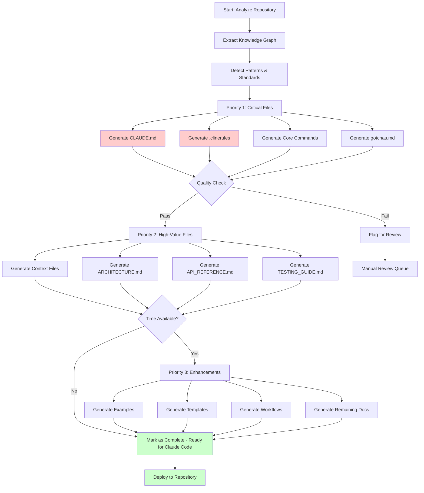

# Claude Code Preparation - Complete File Map

## Visual Overview of All Generated Files

```
repository/
│
├── 🔴 CLAUDE.md                           [CRITICAL] Primary AI context (2-5 pages)
├── 🔴 .clinerules                         [CRITICAL] Coding rules (YAML, ~200 lines)
│
├── .claude/                               [Claude Code Configuration Directory]
│   │
│   ├── commands/                          [Custom Commands - 5 files minimum]
│   │   ├── 🟡 add_feature.md             [HIGH] Scaffold new features
│   │   ├── 🟡 fix_bug.md                 [HIGH] Fix bugs systematically
│   │   ├── 🟡 add_test.md                [HIGH] Add comprehensive tests
│   │   ├── 🟢 refactor_code.md           [MEDIUM] Refactor safely
│   │   └── 🟢 update_docs.md             [MEDIUM] Update documentation
│   │
│   ├── context/                           [Detailed Context - 5 files minimum]
│   │   ├── 🟡 architecture.md            [HIGH] Architecture deep dive
│   │   ├── 🟡 patterns.md                [HIGH] Code patterns & conventions
│   │   ├── 🔴 gotchas.md                 [CRITICAL] Known issues & pitfalls
│   │   ├── 🟡 security.md                [HIGH] Security guidelines
│   │   └── 🟢 performance.md             [MEDIUM] Performance guidelines
│   │
│   ├── examples/                          [Code Examples]
│   │   ├── good_patterns/                [Good pattern examples]
│   │   │   ├── 🟢 api_endpoint_example   [MEDIUM] Well-structured endpoint
│   │   │   ├── 🟢 service_class_example  [MEDIUM] Well-structured service
│   │   │   ├── 🟢 test_example           [MEDIUM] Well-written test
│   │   │   └── 🟢 error_handling_example [MEDIUM] Proper error handling
│   │   │
│   │   ├── bad_patterns/                 [Anti-patterns to avoid]
│   │   │   ├── 🔵 antipattern_1          [LOW] Common mistake
│   │   │   └── 🔵 antipattern_2          [LOW] Another mistake
│   │   │
│   │   └── common_tasks/                 [Task examples]
│   │       ├── 🟢 add_endpoint_example.md   [MEDIUM]
│   │       ├── 🟢 add_model_example.md      [MEDIUM]
│   │       └── 🟢 write_test_example.md     [MEDIUM]
│   │
│   ├── templates/                         [Code Templates]
│   │   ├── 🟢 component_template          [MEDIUM] Component boilerplate
│   │   ├── 🟢 test_template               [MEDIUM] Test boilerplate
│   │   ├── 🟢 api_endpoint_template       [MEDIUM] Endpoint boilerplate
│   │   └── 🟢 model_template              [MEDIUM] Model boilerplate
│   │
│   └── workflows/                         [Process Workflows]
│       ├── 🟢 feature_development.md      [MEDIUM] Feature workflow
│       ├── 🟢 bug_fixing.md               [MEDIUM] Bug fix workflow
│       ├── 🟢 code_review.md              [MEDIUM] Review checklist
│       └── 🟢 deployment.md               [MEDIUM] Deployment process
│
├── 🟡 ARCHITECTURE.md                     [HIGH] Detailed architecture (5-10 pages)
├── 🟡 API_REFERENCE.md                    [HIGH] Complete API docs (varies)
├── 🟡 TESTING_GUIDE.md                    [HIGH] Testing standards (3-5 pages)
├── 🟢 DEPENDENCIES.md                     [MEDIUM] Dependency documentation (2-3 pages)
├── 🟢 CONTRIBUTING.md                     [MEDIUM] Contribution guidelines (2-4 pages)
├── 🟡 SECURITY.md                         [HIGH] Security policies (2-3 pages)
└── 🟢 TROUBLESHOOTING.md                  [MEDIUM] Common issues (2-5 pages)

Legend:
🔴 CRITICAL - Must generate (blocks Claude Code without these)
🟡 HIGH     - Should generate (significantly improves experience)
🟢 MEDIUM   - Nice to have (enhances further)
🔵 LOW      - Optional (nice but not critical)
```

---

## File Generation Priority

### Priority 1: Critical Path (Generate First)
**Required for basic Claude Code functionality**

1. **CLAUDE.md** (15-30 min to generate)
   - Size: 2-5 pages
   - Sections: 10-15 major sections
   - Complexity: High (requires deep analysis)

2. **.clinerules** (10-15 min to generate)
   - Size: ~200 lines YAML
   - Sections: 15-20 rule categories
   - Complexity: Medium (pattern detection)

3. **.claude/commands/add_feature.md** (5-10 min)
   - Most commonly used command
   - High impact on developer productivity

4. **.claude/commands/fix_bug.md** (5-10 min)
   - Second most common use case
   - Critical for maintenance

5. **.claude/commands/add_test.md** (5-10 min)
   - Essential for code quality
   - Required by most teams

6. **.claude/context/gotchas.md** (10-15 min)
   - Prevents common mistakes
   - High value for new developers

**Total Time Priority 1: ~60-90 minutes per repository**

---

### Priority 2: High-Value Files (Generate Second)
**Significantly improves Claude Code effectiveness**

7. **.claude/context/architecture.md** (15-20 min)
   - Helps Claude Code understand system design
   - Critical for architectural decisions

8. **.claude/context/patterns.md** (10-15 min)
   - Ensures consistency
   - Guides Claude Code suggestions

9. **.claude/context/security.md** (10-15 min)
   - Prevents security issues
   - Critical for compliance

10. **ARCHITECTURE.md** (20-30 min)
    - Comprehensive architecture documentation
    - Reference for complex decisions

11. **API_REFERENCE.md** (15-25 min)
    - Essential for API-based projects
    - Helps Claude Code work with APIs

12. **TESTING_GUIDE.md** (10-15 min)
    - Ensures test quality
    - Required for CI/CD

**Total Time Priority 2: ~80-120 minutes per repository**

---

### Priority 3: Enhancement Files (Generate Third)
**Nice-to-have improvements**

13. **.claude/commands/refactor_code.md** (5-10 min)
14. **.claude/commands/update_docs.md** (5-10 min)
15. **.claude/context/performance.md** (10-15 min)
16. **.claude/examples/** (20-30 min for all)
17. **.claude/templates/** (15-20 min for all)
18. **.claude/workflows/** (15-20 min for all)
19. **DEPENDENCIES.md** (10-15 min)
20. **CONTRIBUTING.md** (10-15 min)
21. **SECURITY.md** (if not in .claude/context)
22. **TROUBLESHOOTING.md** (10-15 min)

**Total Time Priority 3: ~100-150 minutes per repository**

---

## Total Generation Time Estimates

### Minimum Viable (Priority 1 only)
- **Time per repo:** 60-90 minutes
- **For 1,000 repos:**
  - Sequential: 1,000-1,500 hours (125-187 days @ 8hr/day)
  - Parallel (8 workers): 125-187 hours (16-24 days @ 8hr/day)
  - Parallel (16 workers): 63-94 hours (8-12 days @ 8hr/day)

### Recommended (Priority 1 + 2)
- **Time per repo:** 140-210 minutes (2.3-3.5 hours)
- **For 1,000 repos:**
  - Sequential: 2,300-3,500 hours (287-437 days @ 8hr/day)
  - Parallel (8 workers): 287-437 hours (36-55 days @ 8hr/day)
  - Parallel (16 workers): 144-219 hours (18-27 days @ 8hr/day)

### Complete (All Priorities)
- **Time per repo:** 240-360 minutes (4-6 hours)
- **For 1,000 repos:**
  - Sequential: 4,000-6,000 hours (500-750 days @ 8hr/day)
  - Parallel (8 workers): 500-750 hours (63-94 days @ 8hr/day)
  - Parallel (16 workers): 250-375 hours (31-47 days @ 8hr/day)

---

## File Size Estimates

### Per Repository

| File | Size | Lines |
|------|------|-------|
| CLAUDE.md | 50-100 KB | 1,000-2,000 |
| .clinerules | 10-15 KB | 200-300 |
| Each command file | 5-10 KB | 100-200 |
| Each context file | 10-20 KB | 200-400 |
| Each example | 2-5 KB | 50-100 |
| Each template | 5-10 KB | 100-200 |
| Each workflow | 5-10 KB | 100-200 |
| Supporting docs | 20-50 KB each | 400-1,000 each |

**Total per repo (Priority 1):** ~200-300 KB  
**Total per repo (Priority 1+2):** ~400-600 KB  
**Total per repo (Complete):** ~600-900 KB

### For 1,000 Repositories

| Priority Level | Total Size | Docs Count |
|----------------|------------|------------|
| Priority 1 | 200-300 MB | ~6,000 files |
| Priority 1+2 | 400-600 MB | ~12,000 files |
| Complete | 600-900 MB | ~22,000 files |

---

## Generation Workflow Diagram



---

## Quality Metrics

### For Each Generated File

**Completeness Score (0-100):**
- All required sections present: +40
- No placeholder text: +20
- Real data from analysis: +20
- Examples included: +10
- Cross-references work: +10

**Accuracy Score (0-100):**
- Reflects actual codebase: +30
- Current conventions used: +25
- Valid code examples: +25
- Correct file paths: +10
- Correct dependencies: +10

**Usefulness Score (0-100):**
- Actionable information: +30
- Concrete examples: +25
- Clear guidance: +25
- Prioritized content: +10
- Easy to navigate: +10

**Target Scores:**
- Completeness: >85
- Accuracy: >90
- Usefulness: >80

---

## Batch Processing Strategy

### For 1,000 Repositories

**Phase 1: Quick Pass (Priority 1 only)**
- Duration: 2-3 weeks with 16 workers
- Output: All repos have basic Claude Code support
- Developers can start using Claude Code immediately

**Phase 2: Enhancement Pass (Add Priority 2)**
- Duration: 2-3 weeks with 16 workers
- Output: All repos have comprehensive support
- Developers get significantly better experience

**Phase 3: Polish Pass (Add Priority 3)**
- Duration: 2-3 weeks with 16 workers
- Output: All repos have complete documentation
- Developers get optimal experience

**Total Timeline: 6-9 weeks for complete organization coverage**

### Incremental Updates

**Trigger conditions:**
- Code changes (git commits)
- New dependencies added
- Major refactoring
- Security updates
- Performance improvements

**Update strategy:**
- Regenerate affected files only
- Incremental updates (not full regeneration)
- Priority 1 files updated weekly
- Priority 2 files updated monthly
- Priority 3 files updated quarterly

---

## Storage Requirements

### Development Environment
- Per repo working space: 1-2 MB
- Temporary analysis data: 5-10 MB per repo
- Total for 1,000 repos: 6-12 GB

### Production Storage
- Generated files (Priority 1): 200-300 MB
- Generated files (Priority 1+2): 400-600 MB
- Generated files (Complete): 600-900 MB
- Git storage overhead: ~2x
- **Total for 1,000 repos: 1.2-1.8 GB**

### Infrastructure Needs
- Compute: 16-32 cores for parallel processing
- Memory: 4-8 GB per worker (64-256 GB total)
- Storage: 2-3 GB for 1,000 repos
- Network: Minimal (local processing)

---

## Success Criteria

### Per Repository

**Minimum Success (Priority 1):**
- [ ] CLAUDE.md generated and complete
- [ ] .clinerules generated with valid YAML
- [ ] Top 3 commands generated
- [ ] gotchas.md generated
- [ ] All files have >85% quality scores
- [ ] Developer can use Claude Code without `/init`

**Full Success (Priority 1+2):**
- [ ] All Priority 1 criteria met
- [ ] Context files generated
- [ ] ARCHITECTURE.md complete
- [ ] API_REFERENCE.md complete (if API exists)
- [ ] TESTING_GUIDE.md complete
- [ ] All files have >90% quality scores
- [ ] Claude Code provides excellent suggestions

**Optimal Success (All Priorities):**
- [ ] All Priority 1+2 criteria met
- [ ] Examples generated
- [ ] Templates generated
- [ ] Workflows documented
- [ ] All supporting docs complete
- [ ] All files have >95% quality scores
- [ ] Claude Code experience is outstanding

### Organization-Wide

**Week 4 Target:**
- [ ] 100+ repos with Priority 1 complete
- [ ] Developer feedback >80% positive
- [ ] Claude Code adoption increasing

**Week 8 Target:**
- [ ] 500+ repos with Priority 1+2 complete
- [ ] Developer velocity measurably improved
- [ ] Claude Code adoption >60%

**Week 12 Target:**
- [ ] 1,000+ repos with all priorities complete
- [ ] Developer velocity +40% average
- [ ] Claude Code adoption >80%

---

*This comprehensive file map ensures every repository is fully prepared for Claude Code with zero manual developer effort.*
