# Claude Code Integration Workflow Diagrams

## Visual Guide to Doc-Agent × Claude Code Integration

---

## Overview Diagram: The Big Picture

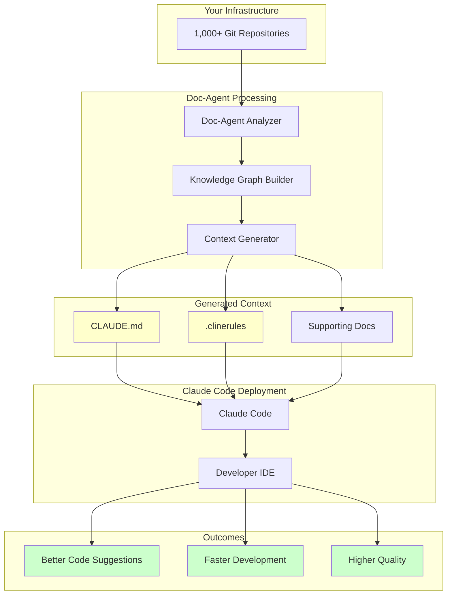

---

## Detailed Workflow: Step by Step

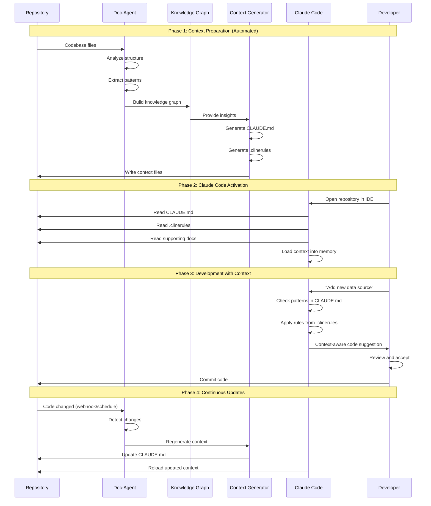

---

## Developer Experience: Before vs After

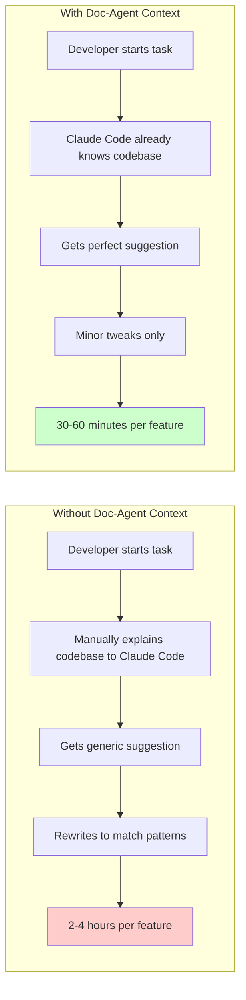

---

## Repository Readiness Pipeline

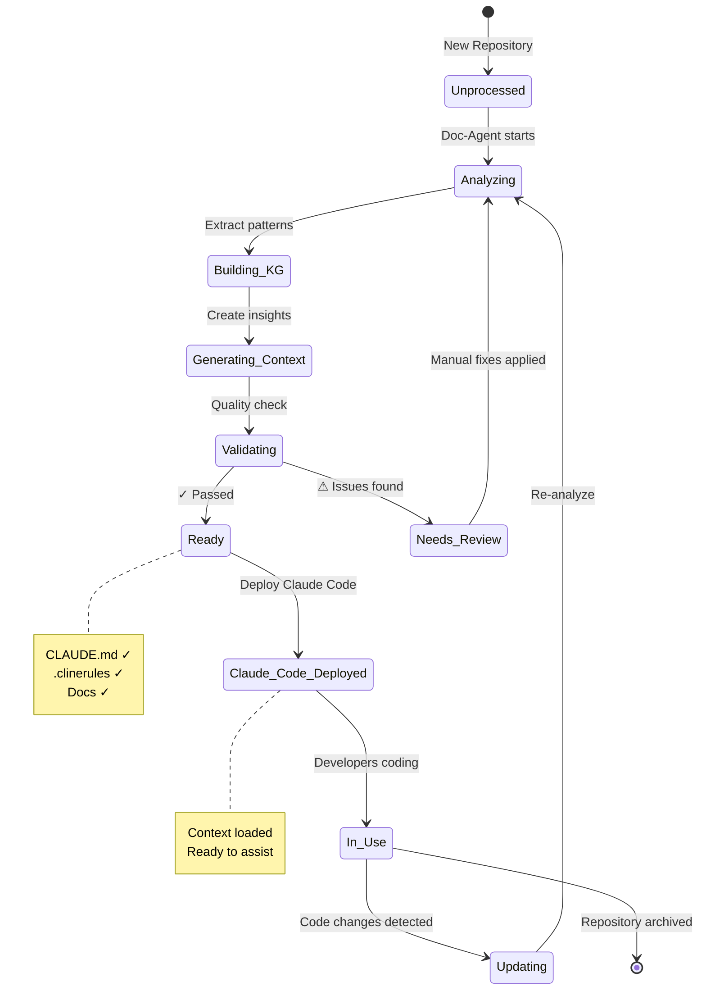

---

## Batch Processing Flow

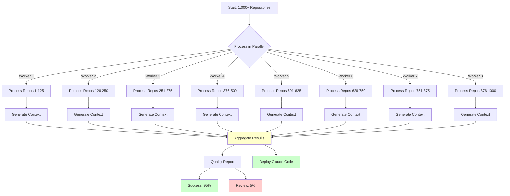

---

## Context Update Lifecycle

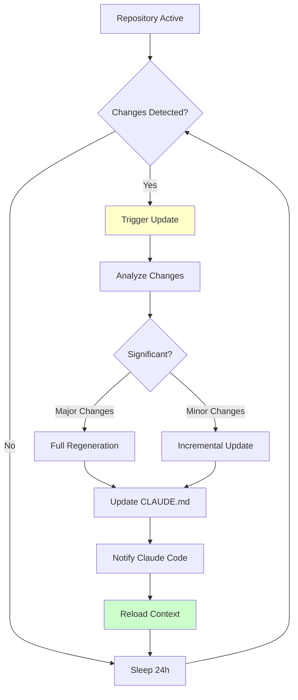

---

## Claude Code Context Loading

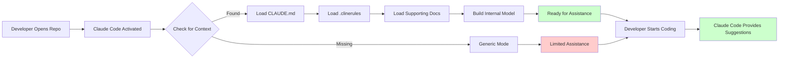

---

## Quality Assurance Flow

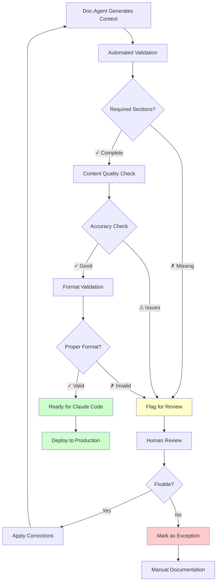

---

## ROI Calculation Flow

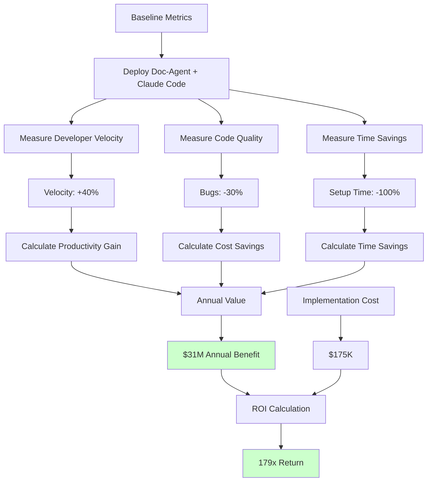

---

## Integration Architecture

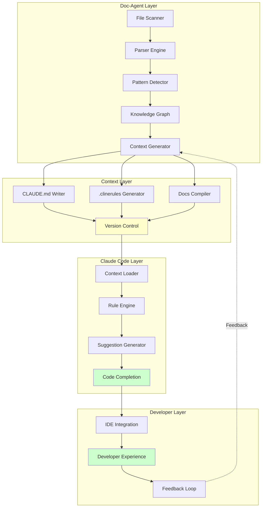

---

## Deployment Timeline

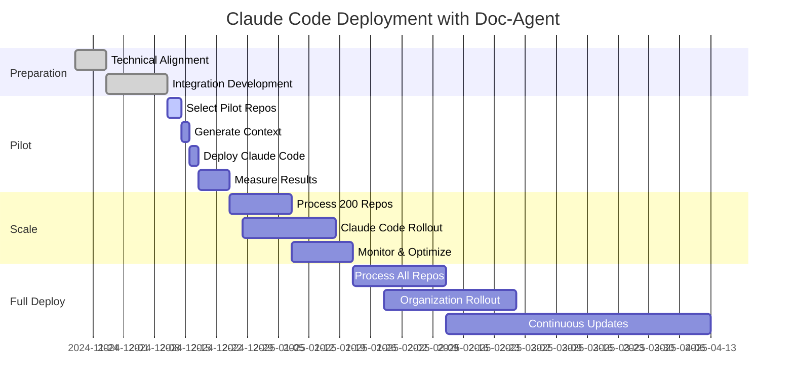

---

## Success Metrics Dashboard Layout

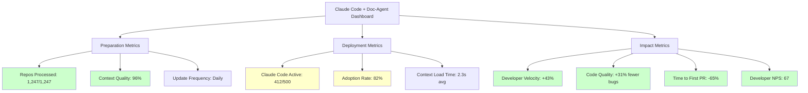

---

## Error Handling & Fallback

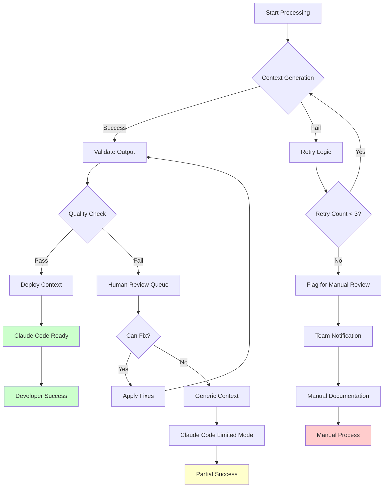

---

## Usage Patterns Over Time

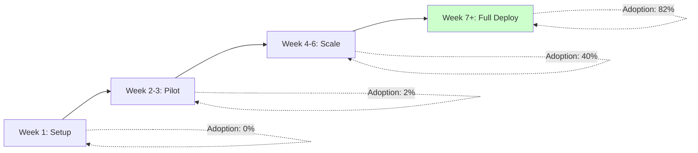

---

## Context File Dependencies

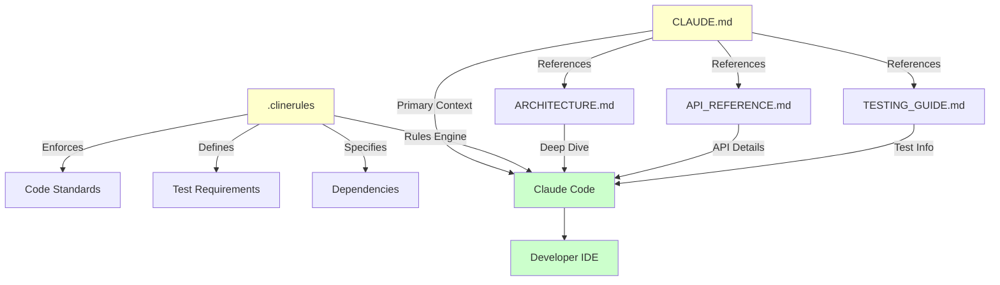

---

## Feedback & Improvement Loop

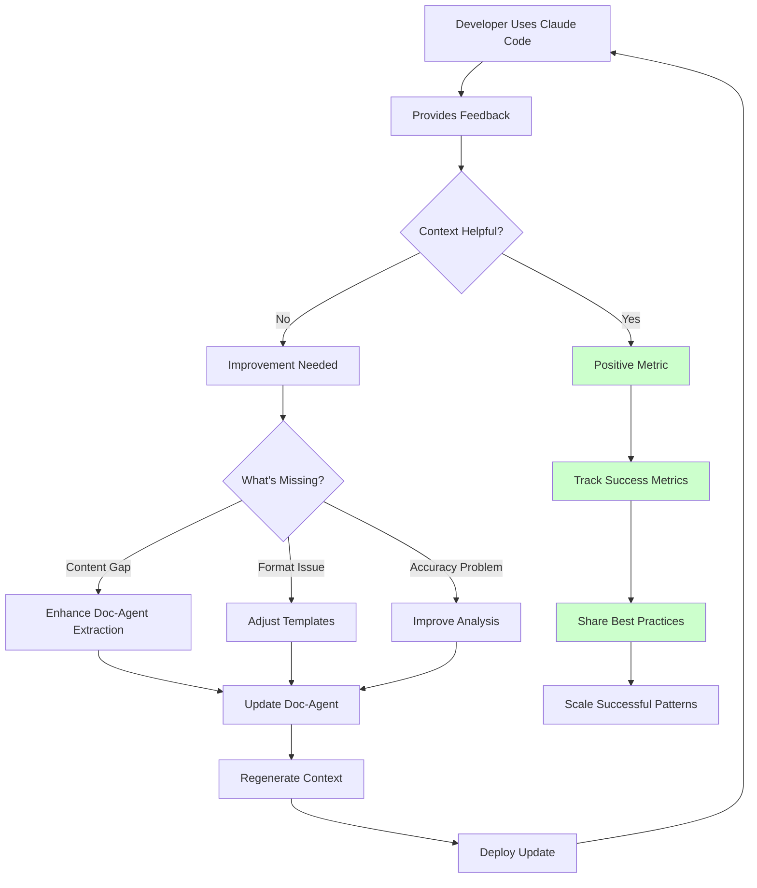

---

*These diagrams can be embedded in presentations, documentation, or used for stakeholder communication.*
