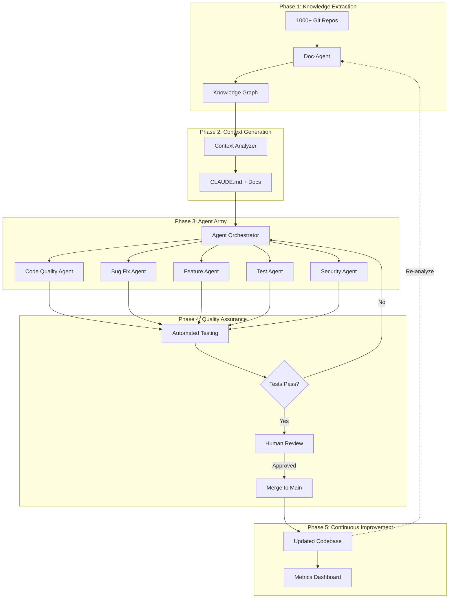

# AI-Powered Code Modernization at Scale
## Executive Pitch: Strategic Initiative

**To:** IT Leadership & Engineering Management  
**Date:** November 2024  
**Subject:** Autonomous Code Modernization Platform

---

## Executive Summary

We have developed a breakthrough approach to modernize our entire codebase using AI agents - transforming what would typically require years of manual effort into an automated, continuous process. Our existing doc-agent, initially built for documentation, can now prepare contextual understanding for an "agent army" that autonomously improves code quality, adds features, and fixes bugs across **thousands of repositories**.

### Key Outcomes
- **10-100x faster** code modernization vs. manual efforts
- **Continuous improvement** across all repositories simultaneously
- **Knowledge preservation** of our institutional codebase understanding
- **Reduced technical debt** without dedicated engineering time
- **Competitive advantage** through AI-native development practices

---

## The Business Problem

### Current State
- **1,000+ repositories** with varying quality, documentation, and technical debt
- **Inconsistent coding patterns** across teams and projects
- **Limited engineering bandwidth** for maintenance and modernization
- **Knowledge silos** - only specific engineers understand specific codebases
- **Technical debt accumulation** faster than we can address it
- **Months or years** to modernize legacy systems manually

### Business Impact
- **Slower feature delivery** due to legacy code complexity
- **Higher maintenance costs** - bugs and issues consume 30-40% of engineering time
- **Talent retention risk** - engineers frustrated with outdated codebases
- **Security vulnerabilities** in older, unmaintained code
- **Competitive disadvantage** - competitors moving faster with modern tech

**Estimated Annual Cost of Current Approach: $5-15M** (in lost productivity, bugs, security issues, and technical debt)

---

## The Solution: AI-Powered Code Modernization Platform

### Three-Phase Architecture

#### Phase 1: Knowledge Extraction (Doc-Agent)
Our existing doc-agent analyzes all codebases to build a comprehensive knowledge graph:
- Processes **Python, Jupyter, SQL, JavaScript, TypeScript, Office documents**
- Extracts **code patterns, dependencies, architecture, common issues**
- Creates **institutional knowledge repository** of our entire codebase

#### Phase 2: Context Generation
Automatically generates AI-optimized documentation for each repository:
- **CLAUDE.md** - Primary context file for AI agents
- **AGENT_INSTRUCTIONS.md** - Specific guidelines per repository
- **ARCHITECTURE.md** - System design and patterns
- **API_REFERENCE.md** - Interface documentation
- **TESTING_GUIDE.md** - Quality assurance standards

#### Phase 3: Agent Army Operations
Deploy specialized AI agents that autonomously:
- **Improve code quality** - refactoring, optimization, style consistency
- **Add features** - implement enhancements based on patterns
- **Fix bugs** - identify and resolve issues automatically
- **Increase test coverage** - generate comprehensive tests
- **Update documentation** - keep docs synchronized with code
- **Audit security** - detect and fix vulnerabilities

---

## Business Value & ROI

### Quantified Benefits

| Benefit | Impact | Annual Value |
|---------|--------|--------------|
| **Reduced Manual Code Review** | 50% reduction in review time | $2-4M |
| **Faster Bug Resolution** | 3x faster mean time to resolution | $1-3M |
| **Technical Debt Reduction** | Continuous modernization of 100+ repos/year | $3-5M |
| **Improved Code Quality** | 40% reduction in production bugs | $2-4M |
| **Knowledge Preservation** | Zero knowledge loss from turnover | $1-2M |
| **Developer Productivity** | 20% more time on features vs. maintenance | $3-6M |
| **Security Improvements** | Proactive vulnerability detection | $1-2M |

**Total Estimated Annual Value: $13-26M**

### Strategic Advantages

1. **First-Mover Advantage** - Few organizations have this capability at scale
2. **AI-Native Culture** - Positions us as leaders in AI-enabled development
3. **Talent Attraction** - Engineers want to work with cutting-edge technology
4. **Scalability** - Platform grows with our codebase automatically
5. **Continuous Improvement** - Gets better over time with learning

---

## Implementation Roadmap

### Phase 1: Proof of Concept (Months 1-2)
**Goal:** Validate approach on 10-20 repositories

**Deliverables:**
- Doc-agent context generation for pilot repos
- 2-3 specialized agents (code quality, bug fixes, testing)
- Human-in-the-loop review process
- Success metrics and dashboards

**Investment:** 2-3 engineers, cloud infrastructure

**Expected Outcome:** 50+ code improvements across pilot repos

### Phase 2: Controlled Rollout (Months 3-4)
**Goal:** Expand to 100-200 repositories

**Deliverables:**
- Full agent suite deployed
- Automated testing and validation
- Integration with CI/CD pipelines
- Team training and documentation

**Investment:** 4-5 engineers, expanded infrastructure

**Expected Outcome:** Measurable quality improvements, ROI validation

### Phase 3: Organization-Wide Deployment (Months 5-6)
**Goal:** Cover all 1,000+ repositories

**Deliverables:**
- Parallel processing at scale
- Advanced monitoring and analytics
- Self-service agent deployment
- Continuous learning system

**Investment:** 6-8 engineers, production infrastructure

**Expected Outcome:** Full platform operational, continuous modernization

### Phase 4: Advanced Capabilities (Months 7-12)
**Goal:** Autonomous feature development and strategic improvements

**Deliverables:**
- Multi-repo coordination
- Architectural refactoring agents
- Business logic enhancement
- Predictive maintenance

**Investment:** Core platform team (4-6 engineers)

**Expected Outcome:** Self-improving codebase, strategic competitive advantage

---

## Risk Mitigation

### Technical Risks

| Risk | Mitigation Strategy |
|------|---------------------|
| **Agent-generated bugs** | Multi-layer testing, human review, gradual rollout |
| **Inconsistent quality** | Strict agent guidelines, validation gates, rollback capability |
| **Security vulnerabilities** | Security-focused agents, automated scanning, manual security review |
| **Performance impact** | Resource limits, scheduling, prioritization system |

### Organizational Risks

| Risk | Mitigation Strategy |
|------|---------------------|
| **Developer resistance** | Early involvement, transparent process, clear benefits demonstration |
| **Process disruption** | Gradual integration, optional adoption initially, extensive training |
| **Skill gap concerns** | Position as augmentation not replacement, upskilling opportunities |
| **Compliance issues** | Audit trails, human approval gates, regulatory review integration |

### Safeguards

1. **Human-in-the-Loop** - All changes require human approval (initially)
2. **Comprehensive Testing** - Automated test suites run before any merge
3. **Rollback Capability** - Easy reversion if issues detected
4. **Monitoring & Alerts** - Real-time quality and performance tracking
5. **Gradual Autonomy** - Start with code quality, expand to features gradually
6. **Audit Trails** - Complete logging of all agent decisions and actions

---

## Success Metrics

### Engineering Metrics
- **Code Quality Score** - Track improvements in complexity, duplication, style
- **Test Coverage** - Measure increase across all repositories
- **Bug Density** - Monitor reduction in production issues
- **Technical Debt Ratio** - Quantify debt reduction over time
- **Time to Resolution** - Faster bug fixes and feature delivery

### Business Metrics
- **Developer Productivity** - % time on feature development vs. maintenance
- **Release Velocity** - Increased deployment frequency
- **Cost Savings** - Reduced bug-related costs and manual refactoring
- **Employee Satisfaction** - Developer NPS and retention rates
- **Competitive Position** - Time-to-market for new features

### Platform Metrics
- **Repositories Processed** - Coverage across codebase
- **Agent Success Rate** - % of approved vs. rejected changes
- **Automation Level** - Reduction in manual code review time
- **Knowledge Graph Completeness** - % of codebase understood

---

## Investment Required

### Year 1 (Setup & Deployment)

| Category | Cost | Notes |
|----------|------|-------|
| **Engineering Team** | $800K-1.2M | 4-6 engineers (platform, AI, DevOps) |
| **Cloud Infrastructure** | $200K-400K | Computing, storage, AI model usage |
| **Tooling & Licenses** | $100K-200K | Development tools, monitoring, security |
| **Training & Change Management** | $50K-100K | Team enablement, documentation |
| **Contingency (20%)** | $230K-380K | Risk buffer |

**Total Year 1: $1.38M - $2.28M**

### Years 2-3 (Operations & Enhancement)
- **Reduced to maintenance team:** 2-3 engineers ($400K-600K/year)
- **Infrastructure costs:** $150K-300K/year
- **Continuous improvement:** $100K-200K/year

**Total Years 2-3: $650K-1.1M per year**

### ROI Analysis
- **Year 1 Investment:** $1.38M - $2.28M
- **Year 1 Returns:** $6M - $13M (conservative, partial year)
- **Year 2-3 Annual Returns:** $13M - $26M
- **3-Year NPV:** $30M - $65M
- **Payback Period:** 2-4 months

**ROI: 500-1,000% over 3 years**

---

## Competitive Landscape

### Industry Trends
- **GitHub Copilot & Competitors** - Individual developer assistance
- **Our Approach** - **Organizational-scale autonomous improvement**
- **Key Differentiator** - We're building institutional AI capability, not just tool adoption

### Market Position
- **Few organizations** have attempted autonomous code modernization at this scale
- **First-mover advantage** in AI-native development practices
- **Recruitment advantage** - attractive to top AI/ML engineering talent
- **Client confidence** - demonstrates technical sophistication and innovation

---

## Architecture Visualization

---

## Recommendations

### Immediate Actions (Next 30 Days)
1. ✅ **Approve proof of concept** - Allocate 2-3 engineers for pilot
2. ✅ **Select pilot repositories** - 10-20 diverse codebases
3. ✅ **Establish success criteria** - Define measurable outcomes
4. ✅ **Form steering committee** - Cross-functional oversight
5. ✅ **Communicate vision** - Share with engineering organization

### Decision Required
We recommend **proceeding with the proof of concept** to validate the approach with minimal risk and demonstrate concrete value within 60 days.

**Ask:** 
- Approval for $150K-200K POC budget
- Allocation of 2-3 senior engineers for 2 months
- Executive sponsorship from IT leadership

---

## Conclusion

This initiative represents a **paradigm shift** in how we manage and improve our codebase. By leveraging our existing doc-agent and extending it with an agent army, we can:

- **Modernize our entire codebase** in months instead of years
- **Reduce technical debt** continuously and automatically
- **Free engineering talent** to focus on innovation
- **Establish competitive advantage** through AI-native development
- **Deliver exceptional ROI** with manageable risk

The technology foundation is proven. The business case is compelling. The timing is right.

**We have the opportunity to lead our industry in AI-powered software development. Let's seize it.**

---

## Appendix

### A. Technical Architecture Details
[Link to detailed technical documentation]

### B. Security & Compliance Framework
[Link to security review and compliance procedures]

### C. Detailed Implementation Timeline
[Link to project plan with milestones and dependencies]

### D. Case Studies & Early Results
[Link to pilot program results and demonstrations]

### E. FAQ & Risk Register
[Link to comprehensive Q&A and risk management plan]

---

## Next Steps

1. **Schedule executive review meeting** - Present findings and recommendations
2. **Q&A session with technical leaders** - Address questions and concerns
3. **Pilot program kickoff** - Begin proof of concept upon approval
4. **Stakeholder communication plan** - Ensure organization-wide awareness

---

**Contact Information:**  
[Your Name]  
[Your Title]  
[Email] | [Phone]

---

*"The best way to predict the future is to build it. Let's build an AI-native development culture."*
