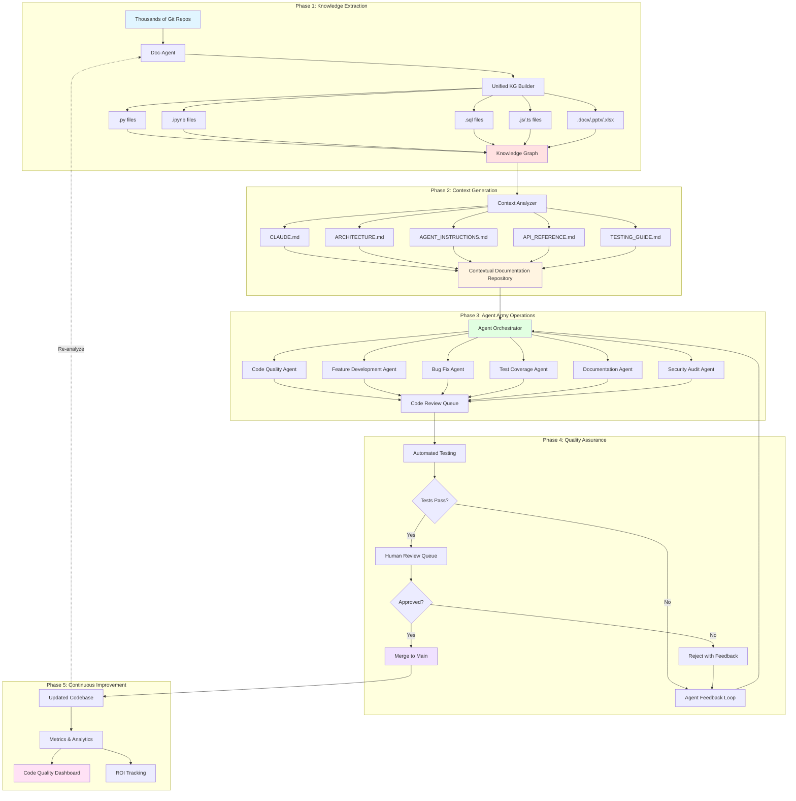
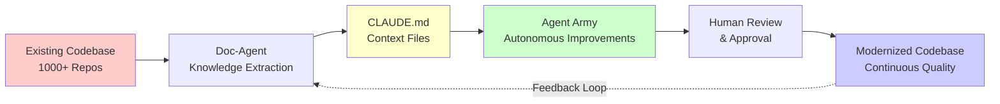
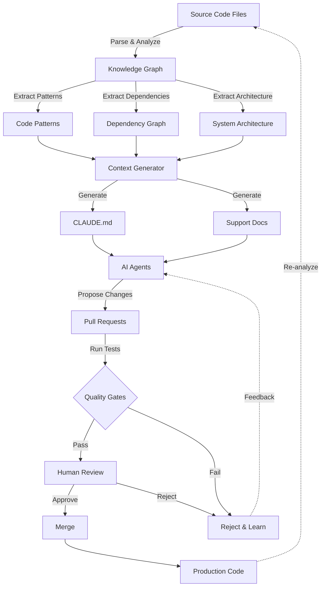
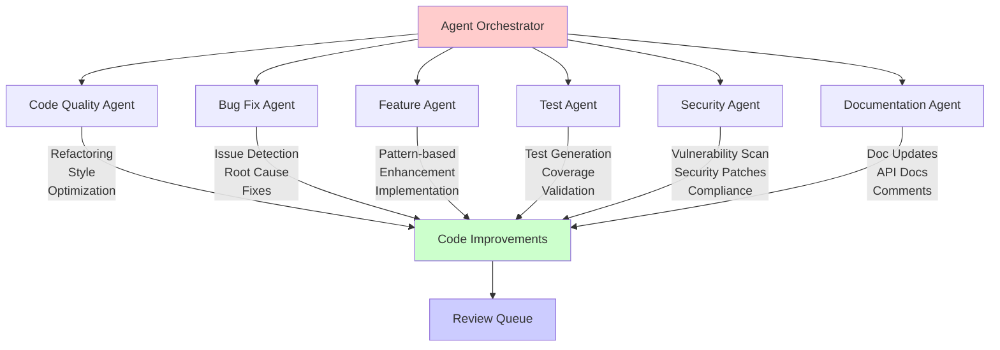
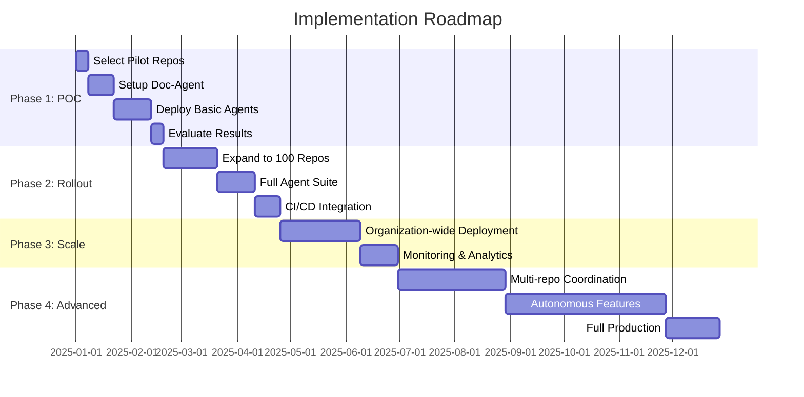
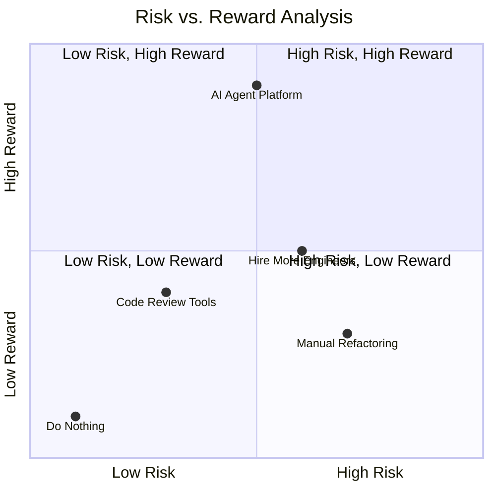
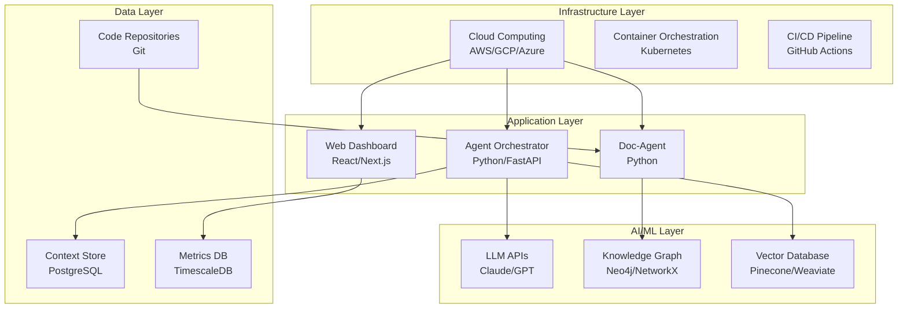
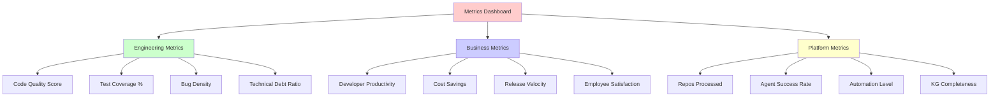

# AI-Powered Code Modernization Pipeline
## Complete System Architecture

This diagram shows the end-to-end pipeline from repository analysis to autonomous code improvement.

## Full Pipeline Diagram



## Simplified Executive View



## Data Flow Diagram



## Agent Specialization



## Implementation Timeline



## Risk vs. Reward Matrix



## Technology Stack



## Success Metrics Dashboard Layout



---

## Usage Notes

### For Presentations
- Copy the desired diagram code block
- Paste into any Mermaid-compatible renderer:
  - GitHub Markdown
  - Mermaid Live Editor (mermaid.live)
  - Notion, Obsidian, or similar tools
  - VS Code with Mermaid extension

### For Documentation
- Include these diagrams in technical documentation
- Use as reference for architecture discussions
- Embed in Confluence, SharePoint, or wikis

### For Stakeholder Communication
- The "Simplified Executive View" is best for leadership
- The "Full Pipeline Diagram" for technical audiences
- The "Implementation Timeline" for project planning
- The "Risk vs. Reward Matrix" for decision-making

---

## Customization

You can easily customize these diagrams by:
1. Changing node labels and descriptions
2. Adding or removing phases
3. Modifying colors with `style` commands
4. Adjusting the layout direction (TB, LR, etc.)

Example color customization:
```
style NodeName fill:#hexcolor
```

Common color codes:
- Blue: `#e1f5ff`
- Red: `#ffe1e1`
- Yellow: `#fff4e1`
- Green: `#e1ffe1`
- Purple: `#f0e1ff`
- Pink: `#ffe1f5`
